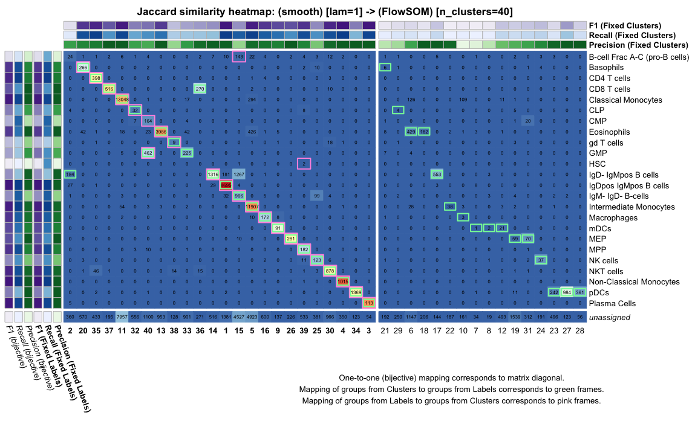
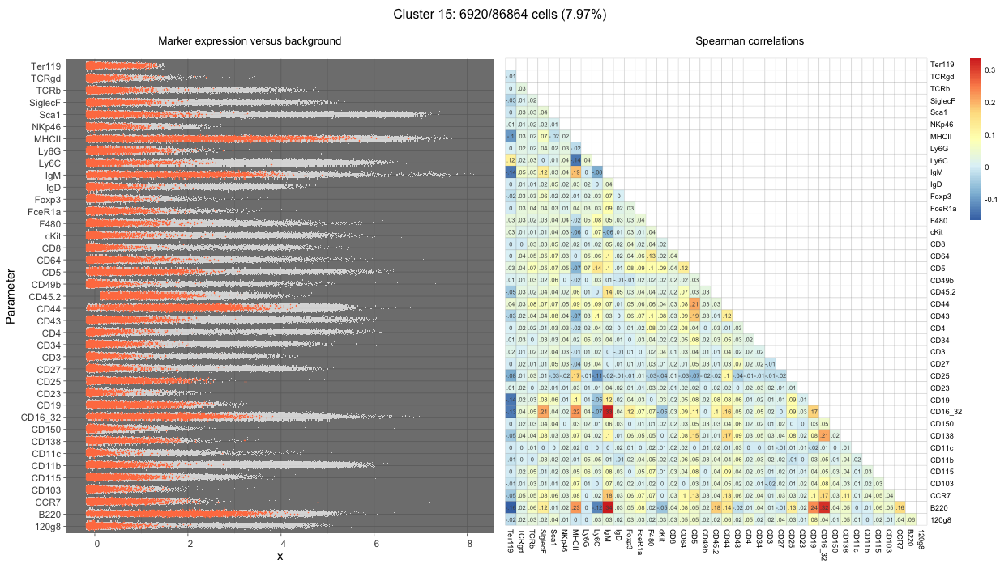
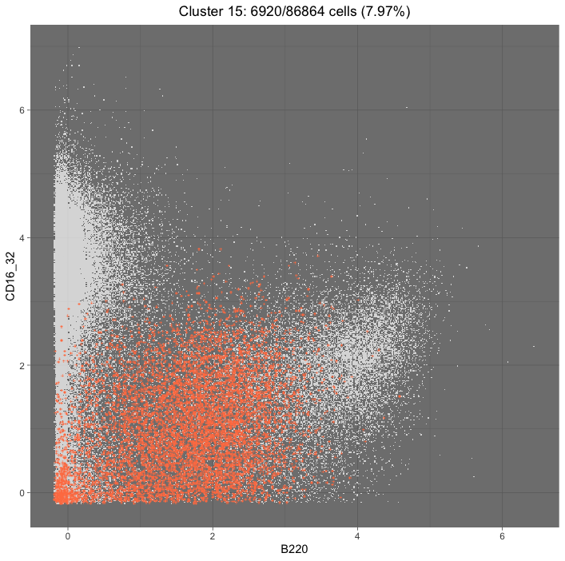
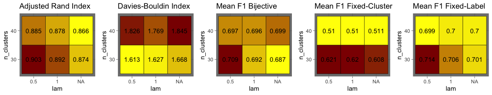

*SingleBench* is an R framework for **optimising exploratory workflows for cytometry data**.
It introduces a unified way of building and running workflows with one or both of two modules:

* **projection**: transformation of inputs by one or more **denoising**/**embedding** (dimension reduction) steps
* **clustering**

It makes it easy to **test the stability of a workflow**, **run parameter sweeps for tuning**, and compare effects of different denoising techniques.
Clustering is automatically scored using interpretable evaluation metrics.

<details>
<summary>**Clustering evaluation details** 📊</summary>

Evaluation of clustering is difficult, with **notable disagreements between metrics** (see [10.1038/nmeth.3583](https://www.nature.com/articles/nmeth.3583)).
In an elegant design, [10.1002/cyto.a.23030](https://onlinelibrary.wiley.com/doi/full/10.1002/cyto.a.23030) compared the performance of clustering algorithms on labelled cytometry data, by matching clusters to cell populations (labels) automatically.

To do this, each cluster was matched to a label using a bijective (one-to-one) matching scheme, implemented using the [Hungarian method](https://en.wikipedia.org/wiki/Hungarian_algorithm) for maximising the total [F1-score](https://en.wikipedia.org/wiki/F-score) of the matches.

However, this leaves unmatched labels if 'underclustering' with respect to the number of annotated populations, or **unmatched clusters if 'overclustering'**.
Those are then omitted from the overall score, which is **misleading if the clustering gives a higher-resolution partitioning of the data that reveals previously unknown sub-populations**.

To address this, we use 3 cluster-label matching schemes, all maximising total F1 across matches:

* **bijective** (one-to-one) scheme: 1 cluster to 1 population
* **fixed-cluster** scheme: 1 cluster possibly matched to multiple populations
* **fixed-label** scheme: 1 population possibly matched to multiple clusters

For exploratory modelling, the **fixed-label scheme** is generally appropriate.
*SingleBench* uses 'similarity heatmaps' to display the results of all 3 matching schemes, to understand and interpret the clustering results better (see `PlotSimilarityHeatmap` below).

The following clustering evaluation metrics are computed by *SingleBench*:

* **Davies-Bouldin index**
* **adjusted Rand index (ARI)**
* **F1, precision and recall** per cluster-label match and on average

<hr>
</details>

Some of the reasons you should use *SingleBench*:

<details>
<summary>**Interpretability of clustering for discovery of new cell types** 👩‍🔬</summary>

Automated clustering of cell types is used massively for discovery in cytometry, scRNA-seq and other single-cell data.
Leveraging annotations of known cell populations, *SingleBench* gives a **complex picture of how labels match up with clusters, using multiple matching schemes**.
This not only evaluates quality of the clustering, but helps discover new subpopulations or mistakes in manual annotation.

<hr>
</details>

<details>
<summary>**Saving up on time and RAM** ⌚</summary>

Implementing a **lightweight workflow management system**, intermediate results are saved using [*rhdf5*](https://www.bioconductor.org/packages/release/bioc/html/rhdf5.html) and recycled.
This **frees up memory, decreases running time and prevents data loss**.
When running a workflow, **parallel processing can be used** for further speed-up, using [*doParallel*](https://cran.r-project.org/web/packages/doParallel/index.html).

Additionally, algorithms relying on *k*-nearest-neighbour graphs (*k*-NNGs) can use a recycled pre-computed *k*-NNG.

<hr>
</details>

<details>
<summary>**Extensibility** 🧩</summary>

Denoising, embedding and clustering algorithms in R/Python are integrated via **wrappers**, which have some minimal formal requirements.
New wrappers can easily be added, with instructions and examples provided.

<hr>
</details>

<details>
<summary>**Early detection of errors** ‼️</summary>

When designing a workflow, *SingleBench* runs **validity checks** to detect potential errors before execution.
These sanity checks help detect mistakes more easily and save time.

</details>

## Installing

Install from R using [*devtools*](https://devtools.r-lib.org):

```
devtools::install_github('davnovak/SingleBench')
```

> [!NOTE]
> Individual denoising, embedding or clustering methods might need to be installed separately.

If planning to call Python tools from *SingleBench*, you will need [*reticulate*](https://rstudio.github.io/reticulate/) and [*Anaconda*](https://www.anaconda.com).

## Usage

<details>
<summary>**Session info for reproducibility of *Usage* section**</summary>

```r
R version 4.3.3 (2024-02-29)
Platform: aarch64-apple-darwin20 (64-bit)
Running under: macOS Sonoma 14.1.1

Matrix products: default
BLAS:   /System/Library/Frameworks/Accelerate.framework/Versions/A/Frameworks/vecLib.framework/Versions/A/libBLAS.dylib 
LAPACK: /Library/Frameworks/R.framework/Versions/4.3-arm64/Resources/lib/libRlapack.dylib;  LAPACK version 3.11.0

locale:
[1] en_US.UTF-8/en_US.UTF-8/en_US.UTF-8/C/en_US.UTF-8/en_US.UTF-8

time zone: Europe/Brussels
tzcode source: internal

attached base packages:
[1] stats     graphics  grDevices utils     datasets  methods   base     

other attached packages:
[1] reticulate_1.37.0 SingleBench_1.0  

loaded via a namespace (and not attached):
 [1] vctrs_0.6.5       cli_3.6.4         rlang_1.1.5       png_0.1-8         purrr_1.0.4       generics_0.1.3    jsonlite_1.9.0   
 [8] glue_1.8.0        colorspace_2.1-1  rprojroot_2.0.4   scales_1.3.0      grid_4.3.3        munsell_0.5.1     tibble_3.2.1     
[15] foreach_1.5.2     lifecycle_1.0.4   compiler_4.3.3    dplyr_1.1.4       codetools_0.2-20  Rcpp_1.0.14       pkgconfig_2.0.3  
[22] here_1.0.1        rstudioapi_0.17.1 lattice_0.22-6    R6_2.6.1          tidyselect_1.2.1  pillar_1.10.1     magrittr_2.0.3   
[29] Matrix_1.6-5      withr_3.0.2       tools_4.3.3       gtable_0.3.6      iterators_1.0.14  ggplot2_3.5.1 
```

</details>

When loaded, **method wrappers** for individual tools are exported to the global namespace.
On start-up, available tools and missing packages are listed.

```r
library(SingleBench)
```

The wrappers can be reloaded at any time using `LoadWrappers()`

<hr>

In the example below, we create a *pipeline*, plug it into a *benchmark* instance, evaluate the benchmark and inspect results.

### Building a pipeline

A pipeline is composed of one or more **subpipelines**: combinations of methods and their input parameters.
Each subpipeline can have one or both of two **modules**: **projection** and **clustering**.

To create a subpipeline for smoothing (*k*-NN-based denoising) followed by *FlowSOM* clustering:

```r
pipeline <- list()
pipeline[[1]] <- 
  Subpipeline(
    projection =
      Module(Fix('smooth', k = 100, n_iter = 1), n_param = 'lam'),
    clustering =
      Module(Fix('FlowSOM', grid_width = 10, grid_height = 10), n_param = 'n_clusters')
  )
```
 
Here, `Fix` assigns fixed values of input parameters
For `smooth`, `k` (neighbourhood size) is fixed at 100 and `n_iter` (number of iterations) at 1.
Both `grid_width` and `grid_height` (SOM dimensionse) are fixed at 10 for `FlowSOM`.

Any `Module` can specify an **optional *variable numeric parameter*: *n*-parameter**.
Here, `lam` (denoising strength coefficient) of `Smooth` and `n_clusters` (number of resulting metaclusters) of `FlowSOM` are assigned as variable.

> [!NOTE]
> The `projection` module can also be a `list` of multiple `Module` objects, applied in succession.

Note that *n*-parameters can be specified for neither, one or both of the modules.
To specify *n*-parameter values:
 
```r
n_params <- list()
n_params[[1]] <- list(
  projection = rep(c(NA, 0.5, 1.0), each = 2),
  clustering = c(30, 40)
)
```

If both modules have an *n*-parameter, **the vectors of values for each will be aligned automatically**, as long as the length of one is a multiple of the length of the other.
Setting the projection *n*-parameter to `NA` skips the projection step.

> [!NOTE]
> If a projection *n*-parameter value is repeated, the projection is only computed once and re-cycled when needed.

To create a second subpipeline with the same projection step, use `CloneFrom`:

```r
pipeline[[2]] <-
  Subpipeline(
    projection = CloneFrom(1),
    clustering = Module(Fix('kmeans'), n_param = 'n_clusters')
  )

n_params[[2]] <- list(
  projection = rep(c(NA, .5, 1.), each = 2),
  clustering = c(30, 40)
)
```

Here, the second subpipeline evaluates the same projection steps as the first one, followed by a *k*-means clustering.

### Running a benchmark

A `Benchmark` object links a pipeline to input data in the format of **a [`SummarizedExperiment`](https://www.bioconductor.org/packages/devel/bioc/vignettes/SummarizedExperiment/inst/doc/SummarizedExperiment.html) object, a vector paths to FCS files, or a [`flowSet`](https://www.bioconductor.org/packages/devel/bioc/vignettes/flowCore/inst/doc/HowTo-flowCore.pdf) object** with some form of labels per cell.

In the example below, we

* download a **CyTOF mouse bone marrow dataset** (*Samusik_01*) using [`HDCytoData`](https://www.bioconductor.org/packages/release/data/experiment/html/HDCytoData.html)
* **only keep '*type*' markers** as encoded in the input's `colData`
* **<i>asinh</i>-transform** the expression values, with co-factor 5
* denote '*unassigned*' as **label for cells without annotation**
* specify to **repeat 5 times** with different random seed, to account for stochasticity
* set '*benchmark.h5*' as an **HDF5 file name for writing data and results**

```r
library(HDCytoData)
d <- Samusik_01_SE()
b <- Benchmark(
  input              = d,
  transform          = 'asinh',
  transform_cofactor = 5,
  input_marker_types = 'type',
  unassigned_labels  = 'unassigned',
  pipeline           = pipeline,
  n_params           = n_params,
  stability_repeat   = 5,
  h5_path            = 'benchmark.h5'
)
```

Before evaluating the benchmark:

* use `print(b)` to get a read-out of settings and check for mistakes
* for **parallel processing**, check number of available CPU cores using `parallel::detectCores()` and decide how many to use

Then run:

```r
Evaluate(b, verbose = TRUE) # specify `n_cores` for parallel processing
```

With `verbose = TRUE`, progress messages are shown during evaluation.

<details>
<summary>**2-d embedding for visualisation** (OPTIONAL)</summary>

A 2-dimensional embedding can help view the data and results.
Some dimensionality reduction (DR) tool wrappers are provided by default for this purpose.
To generate a layout and bind it to the data:

```
AddLayout(b, method = Fix('UMAP', latent_dim = 2))
```

</details>

### Extracting results

A read-out summarising results of an evaluated benchmark can be printed using `print(b)`.
Dedicated functions are provided for extracting data and results in numeric form.

<details>
<summary>**Extractor functions**</summary>

* `GetExpressionMatrix` for single-cell expression values
* `GetProjection` for output of the projection module
* `GetAnnotation` for vector of labels per cell
* `GetPopulationSizes` for cell counts per labelled population
* `GetRMSDPerPopulation` for population variability
* `GetLayout` for 2-dimensional layout of data (if generated)
* `GetClustering` for vector of cluster assignments per cell

For the clustering step, additional getter functions are available:

* `GetClusterSizes` for cell counts per cluster
* `GetRMSDPerCluster` for cluster variability

Each of these is documented: for instance, run `?GetRMSDPerPopulation` for guidance.

<hr>
</details>

### Interpreting clustering results

A range of informative plots are helpful for interpretation.

* Importantly, **`PlotSimilarityHeatmap` displays cluster-label matches** for a chosen iteration of clustering, comparing results from different matching schemes.

```r
PlotSimilarityHeatmap(b, idx.subpipeline = 1, idx.n_param = 6, idx.run = 1)
```

<center></center>

Then to inspect the **expression profile** of a cluster/population of interest, use `WhatIs`:

```r
WhatIs(b, idx.subpipeline = 1, idx.n_param = 6, idx.run = 1, cluster = 15)
```

This shows the distribution of signal per marker from the subset of interest, and how it compares to the background distributions (all cells).
Spearman correlations between marker signal are also shown, to give an overview of single-cell-level patterns in marker expression that identify this compartment:

<center></center>

These patterns can then be inspected further by plotting a biaxial expression plot for two markers of interest at a time, using the same function with the markers additionally specified:

```r
WhatIs(b, idx.subpipeline = 1, idx.n_param = 6, idx.run = 1, cluster = 15,
       marker1 = 'B220', marker2 = 'CD16_32', pointsize_fg = 1.5)
```

<center></center>

* Alternatively, use `PlotClusterHeatmap` or `PlotPopulationHeatmap` to look at all clusters/populations.
* `PlotCompositionMap` shows the composition of a cluster in terms of labelled populations.
* To visualise the clusters or annotated populations using a previously generated 2-dimensional layout, use `PlotClustersOverlay` or `PlotLabelsOverlay`.

For hyperparameter tuning, the resulting scores per *n*-parameter value can be compared in a line plot or heatmap (if two *n*-parameters were varied) using `PlotNParameterMap_Clustering`:

```r
PlotNParameterMap_Clustering(b, idx.subpipeline = 1, nrow = 1)
```

<center></center>

## Extending

Usage of projection/clustering tools is specified by **method wrappers**: functions with a prescribed signature that allow `SingleBench` to use them.
The recipes for wrappers are R scripts located in `inst/extdata/` in the `wrappers_projection` and `wrappers_clustering` directories.
**Wrappers are generated using the `WrapTool` function.**
For instructions on wrapping new tools, check the function documentation using `?WrapTool` and existing wrappers that are already provided.
